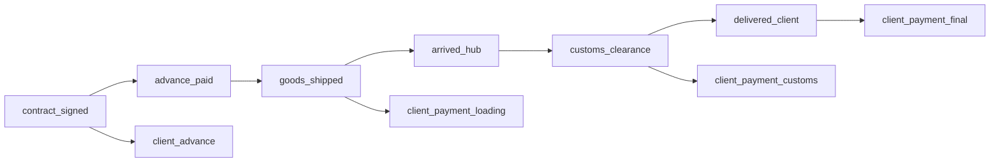

# Multi-Currency Plan-Fact System Design

**Date:** 2025-11-11
**Status:** Approved for Implementation
**Estimated Effort:** 35-45 hours (20-25 hours with parallel agents)

---

## Table of Contents

1. [Overview](#overview)
2. [Business Requirements](#business-requirements)
3. [Architecture Decisions](#architecture-decisions)
4. [Database Schema](#database-schema)
5. [API Design](#api-design)
6. [Frontend UI Design](#frontend-ui-design)
7. [Implementation Plan](#implementation-plan)
8. [Testing Strategy](#testing-strategy)
9. [Success Criteria](#success-criteria)

---

## Overview

### Problem Statement

The quotation system needs three interconnected features:

1. **Quote Versioning:** Sales managers iterate quotes (sent v1 → edit → sent v2 → sent v3), and clients may accept any version (not just the latest). Need to preserve calculation results for each version.

2. **Plan-Fact Tracking:** When a quote is accepted (becomes a deal), track planned vs actual costs and profit across multiple expense categories. Different managers enter facts for their sections (logistics manager for logistics, finance manager for all costs).

3. **Multi-Currency System:** Organization needs an internal base currency for analytics. All quotes store aggregated values in two currencies: quote currency (for client) and organization currency (for analytics). Managers can enter costs in any currency with automatic conversion.

### Key Challenges

- **Versioning Complexity:** Client may accept v1 after seeing v2 and v3 → need calculation snapshots for all sent versions
- **Timeline Dependencies:** Delivery delays affect financing costs → automatic recalculation based on actual event dates
- **Currency Flexibility:** Costs entered in TRY/CNY/USD, but analytics need unified currency → dual storage with historical exchange rates
- **Granular Permissions:** Logistics manager edits only logistics, finance manager edits all → section-level access control

### Solution Summary

**Separate tables approach** with precomputed summaries:
- Quote versions stored separately from main quote
- Calculation results snapshotted per version
- Plan-fact tables with dual currency storage
- Timeline events trigger automatic financing recalculation
- Permission table for section-level access control

---

## Business Requirements

### R1: Quote Versioning

**User Story:** As a sales manager, I need to create multiple versions of a quote (adjusting markup, terms) and allow the client to accept any version they prefer, not just the latest.

**Acceptance Criteria:**
- Create new version: sent v1 → edit → sent v2 (increment version number)
- Accept any version: client chooses v1 from [v1, v2, v3] → v1 becomes accepted
- Calculation snapshot: each sent version stores calculation results (costs, profit, margin)
- UI comparison: show diff between any two versions
- Plan-fact uses accepted version as baseline

**Rationale:** Clients often negotiate and may return to earlier pricing. Need to preserve all versions with exact calculations (exchange rates, formulas may change over time).

---

### R2: Plan-Fact Tracking

**User Story:** As a financial manager, I need to track planned vs actual costs per section to analyze profitability after deal execution.

**Acceptance Criteria:**

**Section-Level Facts (quote-level with distribution):**
- Logistics (3 stages: supplier→hub, hub→customs, customs→client)
  - Input mode: total sum OR per stage
  - Auto-distribution: if total entered, distribute by plan proportions
- Brokerage (customs clearance costs)
- Financing (automatic recalculation, not manual entry)

**Product-Level Facts:**
- Purchase price per product
- Duties per product
- Excise per product
- Util fee per product
- Revenue (sale price) per product

**Derived Values:**
- Fact total cost = SUM(all section facts + product facts) + financing recalculated
- Fact profit = Fact revenue - Fact total cost
- Delta = Fact - Plan (red if negative, green if positive)

**Permissions:**
- Logistics manager: edit logistics only
- Finance manager: edit purchase, duties, excise, revenue, financing events
- Admin/Owner: edit all sections

---

### R3: Multi-Currency System

**User Story:** As a CFO, I need all financial data in a unified currency (USD/RUB/EUR) for analytics, regardless of quote currency.

**Acceptance Criteria:**
- Organization settings: base_currency (USD, RUB, EUR, CNY, TRY, AED)
- Dual storage: all aggregated values stored in quote_currency AND org_currency
- Quote creation: show results in both currencies (primary row: quote currency, secondary row: org currency)
- Plan-fact entry: accept any currency, auto-convert to both quote and org currencies using exchange rate on fact_date
- Currency change: old quotes remain in old currency, new quotes use new currency (no retroactive recalculation)

**Exchange Rate Integration:**
- Use existing exchange_rates table (CBR API, daily updates)
- Historical rates: use rate on fact_date (when expense occurred), not entry date
- Fallback: if rate unavailable, use nearest date (±3 days)
- Cross-rates: TRY→USD via RUB (TRY→RUB→USD)

---

### R4: Timeline & Financing Recalculation

**User Story:** As a finance manager, I need financing costs to reflect actual timeline delays (late delivery, late payment).

**Timeline Events:**
- contract_signed, advance_paid, goods_shipped, arrived_hub, customs_clearance, delivered_client
- client_advance, client_payment_loading, client_payment_customs, client_payment_final

**Financing Logic:**
- Plan: calculated in quote creation based on planned timeline
- Fact: recalculated based on actual event dates from timeline
- Example: Delivery delayed 30 days → Stage 2 financing extends 30 days → extra interest cost

**Automatic Recalculation:**
- When any timeline event updated → trigger recalculates financing
- Shows breakdown: which event caused extra cost
- Stores snapshot in JSONB for audit

---

## Architecture Decisions

### AD1: Versioning Approach

**Decision:** Separate tables (quote_versions) for history, quotes table holds current version.

**Alternatives Considered:**

1. **Parent-child tree** (Session 31 approach)
   - Pros: Single table, flexible branching
   - Cons: Complex queries (WHERE is_latest=true everywhere), risk of editing old versions, PostgreSQL type error in Session 31

2. **JSON snapshots**
   - Pros: Simple storage
   - Cons: Can't query/filter, no schema validation, poor for analytics

3. **Separate tables** ⭐ **CHOSEN**
   - Pros: Simple queries, read-only history, easy to index, standard pattern
   - Cons: Slight duplication (acceptable)

**Rationale:** Linear version history (v1→v2→v3), no branching needed. Separate tables optimize for common case (read latest) while preserving full history.

---

### AD2: Calculation Results Versioning

**Decision:** Snapshot summary + product-level results for each sent version.

**What to Store:**

**Summary (15 fields):**
```
total_purchase, total_logistics, total_duties, total_brokerage,
total_financing, total_cost, total_revenue, profit, margin_percent,
currency_quote, currency_org, exchange_rate
```

**Product Breakdown (10 fields per product):**
```
purchase_price_total, logistics_allocated, duties_total,
brokerage_allocated, financing_allocated, cogs, sale_price_total,
profit_per_product, margin_percent
```

**NOT Storing:**
- Full 42 input variables (accessible via quote_versions metadata)
- 13 intermediate calculation phases (only final results)

**Rationale:** Summary sufficient for plan-fact analytics. Product breakdown needed for product-level fact entry. Full calculations can be recomputed from quote_versions if needed for debugging.

---

### AD3: Plan-Fact Storage

**Decision:** Hybrid model - section-level + product-level tables with precomputed summary.

**Tables:**
- `plan_fact_sections`: quote-level facts (logistics, brokerage) → distributed to products
- `plan_fact_products`: product-level facts (purchase, duties, excise, revenue)
- `plan_fact_logistics_stages`: 3 logistics stages (optional breakdown)
- `plan_fact_summary`: precomputed aggregates (fast reads)

**Update Strategy:**
- Trigger on INSERT/UPDATE to plan_fact_sections/products → updates plan_fact_summary
- Alternative: Background job every 5 min (if triggers cause locking issues)

**Rationale:** Summary table trades write performance for read speed. Plan-fact dashboard needs fast aggregates, worth the trigger overhead.

---

### AD4: Financing Recalculation

**Decision:** Event-driven recalculation triggered by timeline changes.

**Storage:**
- `quote_timeline_events`: all key events with plan/fact dates
- `plan_fact_financing_recalculated`: result of recalculation
- Trigger: UPDATE quote_timeline_events → recalculate financing

**Formula:**
```python
# Stage 1: Borrow full amount until client advance
stage1_days = fact_advance_date - fact_signing_date
stage1_interest = principal × (1 + daily_rate)^stage1_days - principal

# Stage 2: Borrow reduced amount until final payment
stage2_principal = stage1_result - client_advance
stage2_days = fact_final_payment - fact_advance_date
stage2_interest = stage2_principal × (1 + daily_rate)^stage2_days - stage2_principal

total_financing_cost = stage1_interest + stage2_interest
```

**Rationale:** Financing is complex (two-stage, compound interest, timeline-dependent). Better to automate than expect users to calculate manually.

---

## Database Schema

### 1. Quote Versioning

#### quote_versions

```sql
CREATE TABLE quote_versions (
    id UUID PRIMARY KEY DEFAULT gen_random_uuid(),
    quote_id UUID NOT NULL,  -- references quotes.id
    version INTEGER NOT NULL,
    status VARCHAR(50) NOT NULL,  -- 'sent', 'accepted'

    -- Quote metadata snapshot
    customer_id UUID NOT NULL,
    title TEXT,
    description TEXT,
    quote_date DATE,
    valid_until DATE,
    notes TEXT,
    terms_conditions TEXT,
    seller_company VARCHAR(255),
    offer_sale_type VARCHAR(50),
    offer_incoterms VARCHAR(50),

    -- Version metadata
    created_at TIMESTAMP WITH TIME ZONE DEFAULT NOW(),
    created_by UUID,

    UNIQUE(quote_id, version)
);

CREATE INDEX idx_quote_versions_quote_id ON quote_versions(quote_id);
CREATE INDEX idx_quote_versions_status ON quote_versions(status);
```

#### quotes (modifications)

```sql
ALTER TABLE quotes ADD COLUMN current_version INTEGER DEFAULT 1;
ALTER TABLE quotes ADD COLUMN accepted_version_id UUID REFERENCES quote_versions(id);

CREATE INDEX idx_quotes_accepted_version ON quotes(accepted_version_id);
```

---

#### quote_calculation_summaries_versioned

```sql
CREATE TABLE quote_calculation_summaries_versioned (
    id UUID PRIMARY KEY DEFAULT gen_random_uuid(),
    quote_version_id UUID NOT NULL REFERENCES quote_versions(id) ON DELETE CASCADE,

    -- Costs (quote currency)
    total_purchase_price_quote_currency DECIMAL(15,2),
    total_logistics_quote_currency DECIMAL(15,2),
    total_duties_quote_currency DECIMAL(15,2),
    total_brokerage_quote_currency DECIMAL(15,2),
    total_financing_quote_currency DECIMAL(15,2),
    total_cost_quote_currency DECIMAL(15,2),

    -- Costs (org currency)
    total_purchase_price_org_currency DECIMAL(15,2),
    total_logistics_org_currency DECIMAL(15,2),
    total_duties_org_currency DECIMAL(15,2),
    total_brokerage_org_currency DECIMAL(15,2),
    total_financing_org_currency DECIMAL(15,2),
    total_cost_org_currency DECIMAL(15,2),

    -- Revenue & Profit
    total_revenue_quote_currency DECIMAL(15,2),
    total_revenue_org_currency DECIMAL(15,2),
    profit_quote_currency DECIMAL(15,2),
    profit_org_currency DECIMAL(15,2),
    margin_percent DECIMAL(5,2),

    -- Currencies & Rates
    currency_quote VARCHAR(3),
    currency_org VARCHAR(3),
    exchange_rate_quote_to_org DECIMAL(15,6),

    calculated_at TIMESTAMP WITH TIME ZONE DEFAULT NOW(),

    UNIQUE(quote_version_id)
);

CREATE INDEX idx_calc_summary_version ON quote_calculation_summaries_versioned(quote_version_id);
```

---

#### quote_calculation_products_versioned

```sql
CREATE TABLE quote_calculation_products_versioned (
    id UUID PRIMARY KEY DEFAULT gen_random_uuid(),
    quote_version_id UUID NOT NULL REFERENCES quote_versions(id) ON DELETE CASCADE,
    product_id UUID NOT NULL,

    -- Product calculations (quote currency)
    purchase_price_total DECIMAL(15,2),
    logistics_allocated DECIMAL(15,2),
    duties_total DECIMAL(15,2),
    brokerage_allocated DECIMAL(15,2),
    financing_allocated DECIMAL(15,2),
    cost_of_goods_sold DECIMAL(15,2),
    sale_price_per_unit DECIMAL(15,2),
    sale_price_total DECIMAL(15,2),
    profit_per_product DECIMAL(15,2),
    margin_percent DECIMAL(5,2),

    -- Product calculations (org currency)
    purchase_price_total_org_currency DECIMAL(15,2),
    cost_of_goods_sold_org_currency DECIMAL(15,2),
    sale_price_total_org_currency DECIMAL(15,2),
    profit_per_product_org_currency DECIMAL(15,2),

    UNIQUE(quote_version_id, product_id)
);

CREATE INDEX idx_calc_products_version ON quote_calculation_products_versioned(quote_version_id);
CREATE INDEX idx_calc_products_product ON quote_calculation_products_versioned(product_id);
```

---

### 2. Organization Currency

#### organizations (modifications)

```sql
ALTER TABLE organizations ADD COLUMN base_currency VARCHAR(3) DEFAULT 'RUB';
ALTER TABLE organizations ADD COLUMN base_currency_updated_at TIMESTAMP WITH TIME ZONE;
```

#### organization_currency_history

```sql
CREATE TABLE organization_currency_history (
    id UUID PRIMARY KEY DEFAULT gen_random_uuid(),
    organization_id UUID NOT NULL REFERENCES organizations(id),
    old_currency VARCHAR(3),
    new_currency VARCHAR(3),
    changed_by UUID,
    changed_at TIMESTAMP WITH TIME ZONE DEFAULT NOW()
);

CREATE INDEX idx_currency_history_org ON organization_currency_history(organization_id);
```

---

### 3. Plan-Fact System

#### plan_fact_sections

```sql
CREATE TABLE plan_fact_sections (
    id UUID PRIMARY KEY DEFAULT gen_random_uuid(),
    quote_id UUID NOT NULL REFERENCES quotes(id),
    quote_version_id UUID NOT NULL REFERENCES quote_versions(id),
    section_type VARCHAR(50) NOT NULL,  -- 'logistics', 'brokerage', 'financing'

    -- Plan (from calculation results)
    plan_amount_quote_currency DECIMAL(15,2),
    plan_amount_org_currency DECIMAL(15,2),

    -- Fact (entered by manager)
    fact_amount DECIMAL(15,2),
    fact_currency VARCHAR(3),
    fact_date DATE NOT NULL,  -- when expense occurred
    fact_amount_quote_currency DECIMAL(15,2),
    fact_amount_org_currency DECIMAL(15,2),

    -- Exchange rates on fact_date
    exchange_rate_to_quote DECIMAL(15,6),
    exchange_rate_to_org DECIMAL(15,6),
    exchange_rate_date DATE,

    -- Metadata
    entered_by UUID,
    entered_at TIMESTAMP WITH TIME ZONE,
    updated_by UUID,
    updated_at TIMESTAMP WITH TIME ZONE,
    notes TEXT,

    UNIQUE(quote_id, section_type)
);

CREATE INDEX idx_plan_fact_sections_quote ON plan_fact_sections(quote_id);
CREATE INDEX idx_plan_fact_sections_version ON plan_fact_sections(quote_version_id);
CREATE INDEX idx_plan_fact_sections_type ON plan_fact_sections(section_type);
```

---

#### plan_fact_products

```sql
CREATE TABLE plan_fact_products (
    id UUID PRIMARY KEY DEFAULT gen_random_uuid(),
    quote_id UUID NOT NULL REFERENCES quotes(id),
    quote_version_id UUID NOT NULL REFERENCES quote_versions(id),
    product_id UUID NOT NULL,
    section_type VARCHAR(50) NOT NULL,  -- 'purchase', 'duties', 'excise', 'util_fee', 'revenue'

    -- Plan
    plan_amount_quote_currency DECIMAL(15,2),
    plan_amount_org_currency DECIMAL(15,2),

    -- Fact
    fact_amount DECIMAL(15,2),
    fact_currency VARCHAR(3),
    fact_date DATE NOT NULL,
    fact_amount_quote_currency DECIMAL(15,2),
    fact_amount_org_currency DECIMAL(15,2),

    -- Exchange rates
    exchange_rate_to_quote DECIMAL(15,6),
    exchange_rate_to_org DECIMAL(15,6),
    exchange_rate_date DATE,

    -- Metadata
    entered_by UUID,
    entered_at TIMESTAMP WITH TIME ZONE,
    updated_by UUID,
    updated_at TIMESTAMP WITH TIME ZONE,
    notes TEXT,

    UNIQUE(quote_id, product_id, section_type)
);

CREATE INDEX idx_plan_fact_products_quote ON plan_fact_products(quote_id);
CREATE INDEX idx_plan_fact_products_product ON plan_fact_products(product_id);
CREATE INDEX idx_plan_fact_products_type ON plan_fact_products(section_type);
```

---

#### plan_fact_logistics_stages

```sql
CREATE TABLE plan_fact_logistics_stages (
    id UUID PRIMARY KEY DEFAULT gen_random_uuid(),
    quote_id UUID NOT NULL REFERENCES quotes(id),
    stage VARCHAR(50) NOT NULL,  -- 'supplier_hub', 'hub_customs', 'customs_client'

    -- Plan
    plan_amount_quote_currency DECIMAL(15,2),
    plan_amount_org_currency DECIMAL(15,2),

    -- Fact
    fact_amount DECIMAL(15,2),
    fact_currency VARCHAR(3),
    fact_date DATE,
    fact_amount_quote_currency DECIMAL(15,2),
    fact_amount_org_currency DECIMAL(15,2),

    -- Exchange rates
    exchange_rate_to_quote DECIMAL(15,6),
    exchange_rate_to_org DECIMAL(15,6),

    -- Metadata
    entered_by UUID,
    entered_at TIMESTAMP WITH TIME ZONE,
    notes TEXT,

    UNIQUE(quote_id, stage)
);

CREATE INDEX idx_logistics_stages_quote ON plan_fact_logistics_stages(quote_id);
```

---

#### plan_fact_summary

```sql
CREATE TABLE plan_fact_summary (
    quote_id UUID PRIMARY KEY REFERENCES quotes(id),
    quote_version_id UUID NOT NULL REFERENCES quote_versions(id),

    -- Plan (from quote_calculation_summaries_versioned)
    plan_total_cost_quote_currency DECIMAL(15,2),
    plan_total_cost_org_currency DECIMAL(15,2),
    plan_total_revenue_quote_currency DECIMAL(15,2),
    plan_total_revenue_org_currency DECIMAL(15,2),
    plan_profit_quote_currency DECIMAL(15,2),
    plan_profit_org_currency DECIMAL(15,2),
    plan_margin_percent DECIMAL(5,2),

    -- Fact (aggregated from sections + products)
    fact_total_cost_quote_currency DECIMAL(15,2),
    fact_total_cost_org_currency DECIMAL(15,2),
    fact_total_revenue_quote_currency DECIMAL(15,2),
    fact_total_revenue_org_currency DECIMAL(15,2),
    fact_profit_quote_currency DECIMAL(15,2),
    fact_profit_org_currency DECIMAL(15,2),
    fact_margin_percent DECIMAL(5,2),

    -- Delta
    delta_cost_quote_currency DECIMAL(15,2),
    delta_cost_org_currency DECIMAL(15,2),
    delta_profit_quote_currency DECIMAL(15,2),
    delta_profit_org_currency DECIMAL(15,2),

    updated_at TIMESTAMP WITH TIME ZONE
);

CREATE INDEX idx_plan_fact_summary_version ON plan_fact_summary(quote_version_id);
```

---

### 4. Timeline & Financing

#### quote_timeline_events

```sql
CREATE TABLE quote_timeline_events (
    id UUID PRIMARY KEY DEFAULT gen_random_uuid(),
    quote_id UUID NOT NULL REFERENCES quotes(id),
    event_type VARCHAR(50) NOT NULL,

    -- Plan
    plan_date DATE,
    plan_days_from_signing INTEGER,

    -- Fact
    fact_date DATE,
    fact_days_from_signing INTEGER,

    -- Delta
    delay_days INTEGER,

    -- Metadata
    entered_by UUID,
    entered_at TIMESTAMP WITH TIME ZONE,
    notes TEXT,

    UNIQUE(quote_id, event_type)
);

CREATE INDEX idx_timeline_quote ON quote_timeline_events(quote_id);
CREATE INDEX idx_timeline_event_type ON quote_timeline_events(event_type);
```

**Event Types:**
- `contract_signed`, `advance_paid`, `goods_shipped`, `arrived_hub`, `customs_clearance`, `delivered_client`
- `client_advance`, `client_payment_loading`, `client_payment_customs`, `client_payment_final`

---

#### plan_fact_financing_recalculated

```sql
CREATE TABLE plan_fact_financing_recalculated (
    quote_id UUID PRIMARY KEY REFERENCES quotes(id),

    -- Plan
    plan_stage1_days INTEGER,
    plan_stage2_days INTEGER,
    plan_total_financing_cost DECIMAL(15,2),

    -- Fact
    fact_stage1_days INTEGER,
    fact_stage2_days INTEGER,
    fact_total_financing_cost DECIMAL(15,2),

    -- Delta
    delta_days INTEGER,
    delta_financing_cost DECIMAL(15,2),

    -- Breakdown
    extra_cost_from_delivery_delay DECIMAL(15,2),
    extra_cost_from_payment_delay DECIMAL(15,2),

    recalculated_at TIMESTAMP WITH TIME ZONE,

    -- Audit
    timeline_snapshot JSONB
);
```

---

### 5. Permissions

#### plan_fact_permissions

```sql
CREATE TABLE plan_fact_permissions (
    id UUID PRIMARY KEY DEFAULT gen_random_uuid(),
    role_id UUID NOT NULL REFERENCES roles(id),
    section_type VARCHAR(50) NOT NULL,
    can_view BOOLEAN DEFAULT false,
    can_edit BOOLEAN DEFAULT false,

    UNIQUE(role_id, section_type)
);

CREATE INDEX idx_plan_fact_permissions_role ON plan_fact_permissions(role_id);
```

**Default Permissions:**
```sql
-- Logistics Manager
INSERT INTO plan_fact_permissions (role_id, section_type, can_view, can_edit) VALUES
  (logistics_manager_role, 'logistics', true, true),
  (logistics_manager_role, 'brokerage', true, false);

-- Finance Manager
INSERT INTO plan_fact_permissions (role_id, section_type, can_view, can_edit) VALUES
  (finance_manager_role, 'purchase', true, true),
  (finance_manager_role, 'duties', true, true),
  (finance_manager_role, 'excise', true, true),
  (finance_manager_role, 'util_fee', true, true),
  (finance_manager_role, 'revenue', true, true),
  (finance_manager_role, 'financing', true, false);  -- read-only (automatic)

-- Admin/Owner: checked via check_admin_permissions() (all access)
```

---

## API Design

### Base Paths

- `/api/quotes/{quote_id}/versions` - Versioning
- `/api/quotes/{quote_id}/plan-fact` - Plan-Fact
- `/api/quotes/{quote_id}/timeline` - Timeline Events
- `/api/exchange-rates` - Currency Conversion
- `/api/organizations/{org_id}/settings` - Org Settings

---

### 1. Versioning APIs

#### GET `/api/quotes/{quote_id}/versions`

List all versions of a quote.

**Auth:** `get_current_user` (org member)

**Response:**
```json
{
  "versions": [
    {
      "id": "v1_uuid",
      "version": 1,
      "status": "sent",
      "created_at": "2025-01-10T10:00:00Z",
      "created_by_name": "Иван Петров",
      "summary": {
        "total_cost_org_currency": 950000,
        "profit_org_currency": 150000,
        "margin_percent": 15.8
      }
    },
    {
      "id": "v3_uuid",
      "version": 3,
      "status": "accepted",
      "is_accepted": true,
      "summary": { ... }
    }
  ],
  "current_version": 3,
  "accepted_version": 3
}
```

---

#### POST `/api/quotes/{quote_id}/versions/create`

Create new version (sent → edit → sent v2).

**Auth:** `require_role(manager_or_above)`

**Request:**
```json
{
  "changes": {
    "title": "Revised quote",
    "notes": "Reduced markup for client"
  },
  "recalculate": true
}
```

**Process:**
1. Snapshot current quote to quote_versions
2. Update quotes with changes
3. Run calculation engine if recalculate=true
4. Save results to quote_calculation_summaries_versioned
5. Increment current_version

**Response:**
```json
{
  "quote_id": "main_uuid",
  "new_version": 2,
  "version_id": "v2_uuid",
  "calculation_summary": { ... },
  "message": "Version 2 created"
}
```

---

#### POST `/api/quotes/{quote_id}/versions/{version}/accept`

Accept specific version (client chose v1 from [v1,v2,v3]).

**Auth:** `require_role(manager_or_above)`

**Request:**
```json
{
  "acceptance_date": "2025-01-20",
  "notes": "Client approved v1"
}
```

**Process:**
1. Set quotes.status = 'accepted'
2. Set quotes.accepted_version_id = version_id
3. Copy calculation results to plan_fact_summary.plan_*
4. Log activity

**Response:**
```json
{
  "quote_id": "main_uuid",
  "accepted_version": 1,
  "plan_summary": {
    "plan_total_cost_org_currency": 950000,
    "plan_profit_org_currency": 150000
  },
  "message": "Version 1 accepted, plan-fact enabled"
}
```

---

### 2. Plan-Fact APIs

#### GET `/api/quotes/{quote_id}/plan-fact/summary`

Get plan vs fact overview.

**Auth:** `get_current_user` + section permissions

**Response:**
```json
{
  "quote_id": "main_uuid",
  "sections": [
    {
      "section": "logistics",
      "plan_amount_org": 95000,
      "fact_amount_org": 114000,
      "delta": 19000,
      "status": "completed",
      "can_edit": true
    },
    {
      "section": "brokerage",
      "plan_amount_org": 50000,
      "fact_amount_org": null,
      "status": "pending",
      "can_edit": false
    }
  ],
  "totals": {
    "plan_total_cost_org": 950000,
    "fact_total_cost_org": 1020000,
    "delta_cost": 70000,
    "plan_profit_org": 150000,
    "fact_profit_org": 80000,
    "delta_profit": -70000
  },
  "completion_percent": 60
}
```

---

#### POST `/api/quotes/{quote_id}/plan-fact/sections/{section}`

Enter fact for section (logistics, brokerage).

**Auth:** `require_section_permission(section, 'edit')`

**Request:**
```json
{
  "fact_amount": 48000,
  "fact_currency": "TRY",
  "fact_date": "2025-11-05",
  "notes": "Paid to TEXCEL"
}
```

**Process:**
1. Check permissions: plan_fact_permissions
2. Load exchange rate on fact_date
3. Convert to quote_currency and org_currency
4. Insert/update plan_fact_sections
5. Trigger updates plan_fact_summary

**Response:**
```json
{
  "section": "logistics",
  "fact_amount_org_currency": 114000,
  "exchange_rates": {
    "TRY_to_USD": 0.025,
    "TRY_to_RUB": 2.375,
    "date": "2025-11-05"
  },
  "delta_vs_plan": 19000,
  "message": "Fact recorded"
}
```

---

#### POST `/api/quotes/{quote_id}/plan-fact/logistics/total`

Enter total logistics (auto-distributes to 3 stages).

**Request:**
```json
{
  "fact_amount": 48000,
  "fact_currency": "TRY",
  "fact_date": "2025-11-05",
  "notes": "Contract with carrier"
}
```

**Process:**
1. Load plan for all 3 stages
2. Calculate proportions: stage1/total, stage2/total, stage3/total
3. Distribute fact_amount by proportions
4. Insert 3 records into plan_fact_logistics_stages
5. Sum to plan_fact_sections.section='logistics'

**Response:**
```json
{
  "section": "logistics",
  "fact_total": 48000,
  "stages": [
    {
      "stage": "supplier_hub",
      "fact_amount_org": 57000,
      "proportion": 0.5
    },
    {
      "stage": "hub_customs",
      "fact_amount_org": 34200,
      "proportion": 0.3
    },
    {
      "stage": "customs_client",
      "fact_amount_org": 22800,
      "proportion": 0.2
    }
  ],
  "message": "Distributed across stages"
}
```

---

#### POST `/api/quotes/{quote_id}/plan-fact/products/{product_id}/{section}`

Enter fact for product (purchase, duties, excise, util_fee, revenue).

**Auth:** `require_section_permission(section, 'edit')`

**Request:**
```json
{
  "fact_amount": 520,
  "fact_currency": "CNY",
  "fact_date": "2025-11-10",
  "notes": "Supplier raised price"
}
```

**Response:** (similar to sections endpoint)

---

#### POST `/api/quotes/{quote_id}/timeline/{event_type}`

Record actual date for timeline event.

**Auth:** `require_manager_or_above()`

**Request:**
```json
{
  "fact_date": "2025-03-12",
  "notes": "Delayed due to certification issues"
}
```

**Process:**
1. Update quote_timeline_events
2. Calculate delay_days = fact_date - plan_date
3. Trigger recalculates financing
4. Update plan_fact_financing_recalculated

**Response:**
```json
{
  "event_type": "goods_shipped",
  "plan_date": "2025-02-10",
  "fact_date": "2025-03-12",
  "delay_days": 30,
  "financing_impact": {
    "plan_cost": 25000,
    "fact_cost": 32000,
    "extra_cost": 7000,
    "reason": "30-day delay extended Stage 2"
  },
  "message": "Financing recalculated"
}
```

---

### 3. Currency APIs

#### POST `/api/exchange-rates/convert`

Convert amount between currencies on specific date.

**Request:**
```json
{
  "amount": 48000,
  "from_currency": "TRY",
  "to_currency": "USD",
  "date": "2025-11-05"
}
```

**Response:**
```json
{
  "result": 1200.00,
  "exchange_rate": 0.025,
  "rate_date": "2025-11-05",
  "source": "cbr_api",
  "calculation": "TRY → RUB → USD"
}
```

---

#### POST `/api/exchange-rates/batch-convert`

Convert to multiple currencies at once.

**Request:**
```json
{
  "amount": 48000,
  "from_currency": "TRY",
  "to_currencies": ["USD", "RUB", "EUR"],
  "date": "2025-11-05"
}
```

**Response:**
```json
{
  "conversions": [
    { "to_currency": "USD", "result": 1200.00, "rate": 0.025 },
    { "to_currency": "RUB", "result": 114000, "rate": 2.375 },
    { "to_currency": "EUR", "result": 1100.00, "rate": 0.0229 }
  ]
}
```

---

### 4. Organization Settings APIs

#### PUT `/api/organizations/{org_id}/settings/currency`

Change organization base currency.

**Auth:** `require_role(admin_or_owner)`

**Request:**
```json
{
  "new_currency": "USD",
  "confirm": true
}
```

**Validation:**
- Warns if existing accepted quotes
- Logs to organization_currency_history

**Response:**
```json
{
  "old_currency": "RUB",
  "new_currency": "USD",
  "warning": "Existing quotes remain in RUB, new quotes use USD"
}
```

---

## Frontend UI Design

### 1. Version Selector Component

**Location:** Quote detail page header

```
┌──────────────────────────────────────┐
│ Версия: [ v3 (accepted) ▼ ]         │
└──────────────────────────────────────┘
     ↓ click
┌──────────────────────────────────────┐
│ v1 (sent)     10.01.2025            │
│ v2 (sent)     12.01.2025            │
│ v3 (accepted) 15.01.2025  ✓ Принято│ ← current
└──────────────────────────────────────┘
```

**Features:**
- Load version data on selection
- Green badge for accepted
- Show date in dropdown

---

### 2. Version Comparison Modal

**Trigger:** Button "Сравнить версии"

```
┌────────────────────────────────────────────────┐
│ Сравнение версий КП25-0001                    │
├────────────────────────────────────────────────┤
│ Параметр         v1          v3         Δ     │
│ ───────────────────────────────────────────── │
│ Цена (RUB)    1,150,000   1,100,000  -50,000 │
│ Затраты       950,000     980,000   +30,000  │
│ Прибыль       200,000     120,000   -80,000  │
│ Маржа         17.4%       10.9%      -6.5%   │
│                                                │
│ [Закрыть]  [Принять v1]  [Принять v3]        │
└────────────────────────────────────────────────┘
```

**Color coding:**
- Red: negative delta (profit down)
- Green: positive delta (costs down)

---

### 3. Plan-Fact Dashboard Page

**New page:** `/quotes/{id}/plan-fact`

**Layout:**

```
┌──────────────────────────────────────────────┐
│ План vs Факт - КП25-0001        [Экспорт]   │
├──────────────────────────────────────────────┤
│ СВОДКА                                       │
│ ┌──────────┬──────────┬──────────┬────────┐ │
│ │          │ План     │ Факт     │ Дельта │ │
│ ├──────────┼──────────┼──────────┼────────┤ │
│ │ Затраты  │ 950,000  │ 1,020,000│ +70k 🔴│ │
│ │ Прибыль  │ 150,000  │ 80,000   │ -70k 🔴│ │
│ └──────────┴──────────┴──────────┴────────┘ │
│                                               │
│ Заполненность: ████░░ 60%                   │
├──────────────────────────────────────────────┤
│ РАЗДЕЛЫ                                      │
│                                               │
│ ▼ Закупка (product-level)        [Ввести]  │
│   SKU-001  План: 50k  Факт: 52k  +2k 🟡    │
│   SKU-002  План: 30k  Факт: -    Pending   │
│                                               │
│ ▼ Логистика (распределяется)    [Ввести]  │
│   Поставщик→Турция  47,500  57,000         │
│   Турция→Таможня    28,500  -              │
│   Таможня→Клиент    19,000  -              │
│                                               │
│ ▶ Финансирование (авто)          [Timeline]│
│   План: 25k  Факт: 32k  +7k 🔴            │
│   Причина: Задержка поставки 30 дней       │
└──────────────────────────────────────────────┘
```

**Features:**
- Collapsible sections
- Progress bar
- Color-coded deltas
- Permission-based "Ввести" buttons

---

### 4. Fact Entry Modal

**Example: Logistics Total**

```
┌────────────────────────────────────────────┐
│ Фактические затраты - Логистика           │
├────────────────────────────────────────────┤
│ Режим ввода:                               │
│   ○ По этапам (3 платежа)                 │
│   ● Общая сумма                            │
│                                            │
│ Сумма: [48,000]  [TRY ▼]                  │
│ Дата расхода: [05.11.2025] 📅            │
│                                            │
│ Курс на 05.11.2025:                        │
│   TRY → USD: 0.025                         │
│   TRY → RUB: 2.375                         │
│                                            │
│ Эквивалент:                                │
│   USD: 1,200.00                            │
│   RUB: 114,000.00                          │
│                                            │
│ Распределение по этапам:                   │
│   Поставщик → Турция (50%): 24,000 TRY    │
│   Турция → Таможня (30%):   14,400 TRY    │
│   Таможня → Клиент (20%):    9,600 TRY    │
│                                            │
│ [Отмена]  [Сохранить]                      │
└────────────────────────────────────────────┘
```

**Validation:**
- Amount > 0
- Date not in future
- Date >= contract signing date
- Exchange rate available (or fallback)

---

### 5. Quote Creation Dual Currency

**Existing page:** `/quotes/create`

**Changes:** Results table shows two rows per product

```
┌────────┬──────────┬──────┬─────────┐
│ Продукт│ Закупка  │ COGS │ Продажа │
├────────┼──────────┼──────┼─────────┤
│ SKF-001│ 500 USD  │ 950  │ 1,100   │
│        │ 47,500₽  │90,250│104,500  │ ← org currency
└────────┴──────────┴──────┴─────────┘
```

**Implementation:**
- Secondary row: gray text, smaller font
- Real-time update on exchange rate change
- Tooltip: "Эквивалент в валюте организации"

---

### 6. Organization Currency Settings

**Location:** `/settings/organization`

```
┌─────────────────────────────────────────┐
│ ▼ Внутренняя валюта расчётов           │
│   Текущая: RUB                          │
│   Новая: [USD ▼]                        │
│                                         │
│   ⚠️ Изменение валюты:                 │
│   • Старые КП останутся в RUB          │
│   • Новые КП будут в USD               │
│                                         │
│   КП в системе: 120 (все в RUB)        │
│                                         │
│   [Отмена]  [Сохранить]                │
└─────────────────────────────────────────┘
```

---

## Implementation Plan

### Phase 1: Foundation (6-7 hours)

**Wave 1.1:** Database Schema (2h)
- Migration 025: organization base_currency
- Migration 026: exchange_rates improvements

**Wave 1.2:** Currency API (3h)
- Organization currency endpoints
- Exchange rate conversion endpoints
- Tests

**Wave 1.3:** Frontend Settings (2h)
- Currency settings UI
- API service integration

---

### Phase 2: Quote Versioning (7-8 hours)

**Wave 2.1:** Database Schema (3h)
- Migration 027: quote_versions table
- Migration 028: calculation_results_versioned tables
- Triggers for snapshots

**Wave 2.2:** Backend API (4h)
- routes/quotes_versions.py
- Integration with calculation engine
- Tests

**Wave 2.3:** Frontend UI (3h)
- VersionSelector component
- VersionComparison modal
- API service

---

### Phase 3: Plan-Fact Backend (8-10 hours)

**Wave 3.1:** Database Schema (4h)
- Migration 029: plan_fact tables
- Migration 030: timeline tables
- Triggers for summary updates

**Wave 3.2:** Sections API (4h, parallel)
- routes/plan_fact.py
- Logistics distribution logic
- Tests

**Wave 3.3:** Products API (4h, parallel)
- Product-level fact endpoints
- Tests

**Wave 3.4:** Timeline & Financing (4h, parallel)
- routes/timeline.py
- services/financing_calculator.py
- Trigger for auto-recalculation
- Tests

---

### Phase 4: Plan-Fact UI (6-7 hours)

**Wave 4.1:** Dashboard Page (5h)
- app/quotes/[id]/plan-fact/page.tsx
- Collapsible sections
- Summary cards
- API service

**Wave 4.2:** Fact Modals (3.5h, parallel)
- SectionFactModal component
- ProductFactModal component
- LogisticsModal component

**Wave 4.3:** Timeline UI (2h)
- TimelineModal component
- Integration

---

### Phase 5: Permissions & Polish (4-5 hours)

**Wave 5.1:** Permissions (3.5h)
- Migration 031: plan_fact_permissions
- Backend: check_section_permission helper
- Frontend: disable buttons

**Wave 5.2:** Dual Currency (2h, parallel)
- Quote creation dual display
- Real-time updates

**Wave 5.3:** Testing (2.5h)
- E2E workflow tests
- Edge cases
- Bug fixes

---

**Total Time:**
- Sequential: 43-54 hours
- Parallel: 31-37 hours (~5 working days)

---

## Testing Strategy

### Unit Tests (50-70 tests)

**Backend (pytest):**
- test_quote_versioning.py (10 tests)
- test_plan_fact_sections.py (12 tests)
- test_plan_fact_products.py (8 tests)
- test_timeline_financing.py (10 tests)
- test_organization_currency.py (5 tests)
- test_exchange_rate_conversion.py (8 tests)

**Frontend (jest):**
- VersionSelector.test.tsx (6 tests)
- SectionFactModal.test.tsx (8 tests)

---

### Integration Tests (20-30 tests)

- test_versioning_flow.py (5 tests)
- test_plan_fact_workflow.py (8 tests)
- test_currency_system.py (4 tests)

---

### E2E Tests (5-10 scenarios)

**Scenario 1: Complete Versioning** (5 min)
- Create v1 → edit → v2 → edit → v3
- Compare versions
- Accept v1
- Verify plan uses v1

**Scenario 2: Plan-Fact Entry** (7 min)
- Enter logistics fact (total mode)
- Enter product facts
- Verify summary updates
- Check permissions

**Scenario 3: Timeline & Financing** (6 min)
- Enter timeline events
- Verify financing recalculates
- Check extra cost calculation

**Scenario 4: Multi-Currency** (5 min)
- Create quote in USD
- Products in CNY, logistics in TRY
- Verify dual currency display

**Scenario 5: Permissions** (4 min)
- Login as logistics manager
- Verify can edit logistics only
- Try edit purchase → 403

---

### Edge Cases

1. **Exchange rate unavailable** → fallback to nearest date ±3 days
2. **Logistics mixed mode** → total + individual stages reconciliation
3. **Timeline retroactive** → recalculate all dependent events
4. **Accept version with existing facts** → error or clear facts
5. **Currency change with existing quotes** → old stay, new use new

---

### Performance Tests

- Concurrent fact entry (10 users)
- Version listing (100 versions)
- Timeline recalculation (10 events)

**Acceptance:**
- Response time < 500ms for fact entry
- Summary updates < 1 second
- No N+1 queries

---

## Success Criteria

### Phase 1-2 (Versioning)
- ✅ Can create 3+ versions
- ✅ Can accept any version
- ✅ Calculation snapshots correct
- ✅ Comparison shows deltas
- ✅ All unit tests pass

### Phase 3-4 (Plan-Fact)
- ✅ Enter facts for all sections
- ✅ Currency conversion accurate
- ✅ Logistics distribution correct
- ✅ Summary aggregates correctly
- ✅ Permissions enforced
- ✅ All unit tests pass

### Phase 5 (Timeline & Financing)
- ✅ Timeline events recorded
- ✅ Financing recalculates automatically
- ✅ Extra cost formula matches engine
- ✅ All integration tests pass

### Overall
- ✅ 0 TypeScript errors
- ✅ Backend coverage > 70%
- ✅ All E2E scenarios pass
- ✅ No performance regressions

---

## Capacity Planning

### Database Growth Estimates

**Assumptions:**
- 350 quotes/month
- 20% have 2-3 versions (avg 1.3 versions per quote)
- 10 products per quote average

**Annual Growth:**
- quote_versions: 5,460 rows × 1.5 KB = 8.2 MB
- quote_calculation_summaries_versioned: 5,460 rows × 120 bytes = 655 KB
- quote_calculation_products_versioned: 54,600 rows × 80 bytes = 4.4 MB
- plan_fact_sections: 25,200 rows × 100 bytes = 2.5 MB
- plan_fact_products: 126,000 rows × 80 bytes = 10 MB
- quote_timeline_events: 16,800 rows × 60 bytes = 1 MB

**Total raw data per year:** ~27 MB

**With indexes (×3.5):** ~95 MB/year

**5-year projection:** ~473 MB

**Conclusion:** Negligible growth, no optimization needed for 5+ years.

---

## Risks & Mitigation

### Risk 1: Timeline Recalculation Performance
**Impact:** High (blocks UI)
**Probability:** Medium
**Mitigation:**
- Cache intermediate calculations
- Limit to 20 timeline events per quote
- Async processing if > 10 events
- Show loading indicator

### Risk 2: Currency Rate Unavailable
**Impact:** Medium (blocks fact entry)
**Probability:** Low
**Mitigation:**
- Fallback to nearest date ±3 days
- Manual rate entry option
- Admin alert if > 5% of requests fallback

### Risk 3: Permissions Complexity
**Impact:** Medium (confusion)
**Probability:** Medium
**Mitigation:**
- Clear UI indicators (disabled buttons)
- Tooltip: "Требуется роль: Finance Manager"
- Admin page to view/edit permissions

### Risk 4: Trigger Performance on Large Quotes
**Impact:** Medium (slow inserts)
**Probability:** Low
**Mitigation:**
- Optimize trigger SQL
- Consider async summary updates (5 min job)
- Monitor query times

---

## Future Enhancements

### Phase 2 Features (Deferred)

1. **Email Notifications**
   - Notify finance manager when logistics fact entered
   - Alert on timeline delays > 7 days
   - Weekly plan-fact summary report

2. **Advanced Analytics**
   - Trend analysis: profit margins over time
   - Variance reports: top 10 quotes with largest deltas
   - Predictive: financing cost based on historical delays

3. **Audit Trail**
   - Full edit history for facts
   - Diff view: before/after changes
   - Export audit log to CSV

4. **Bulk Operations**
   - Enter facts for multiple quotes at once
   - Import from Excel (bulk fact entry)
   - Batch timeline updates

5. **Mobile UI**
   - Simplified plan-fact entry on mobile
   - Photo upload for receipts
   - Push notifications

---

## Appendix

### A. Database Size Calculation Details

```
quote_versions:
  Fields: 30 × ~50 bytes = 1.5 KB per row
  Rows/year: 4,200 quotes × 1.3 versions = 5,460
  Size: 8.2 MB/year

quote_calculation_summaries_versioned:
  Fields: 15 DECIMAL × 8 bytes = 120 bytes per row
  Rows/year: 5,460
  Size: 655 KB/year

quote_calculation_products_versioned:
  Fields: 10 DECIMAL × 8 bytes = 80 bytes per row
  Rows/year: 5,460 versions × 10 products = 54,600
  Size: 4.4 MB/year

plan_fact_sections:
  Fields: ~10 × 10 bytes = 100 bytes per row
  Rows/year: 4,200 quotes × 6 sections = 25,200
  Size: 2.5 MB/year

plan_fact_products:
  Fields: ~8 × 10 bytes = 80 bytes per row
  Rows/year: 4,200 quotes × 10 products × 3 sections = 126,000
  Size: 10 MB/year

quote_timeline_events:
  Fields: ~6 × 10 bytes = 60 bytes per row
  Rows/year: 4,200 quotes × 4 events = 16,800
  Size: 1 MB/year

Total raw: 27 MB/year
With indexes (×3.5): 95 MB/year
```

### B. API Response Time Targets

| Endpoint | Target | Max Acceptable |
|----------|--------|----------------|
| GET versions list | < 200ms | 500ms |
| POST create version | < 1s | 2s |
| POST accept version | < 500ms | 1s |
| GET plan-fact summary | < 300ms | 800ms |
| POST enter fact | < 400ms | 1s |
| POST timeline event | < 1.5s | 3s |
| GET exchange rate | < 100ms | 300ms |

### C. Permission Matrix

| Role | Logistics | Brokerage | Purchase | Duties | Excise | Revenue | Financing |
|------|-----------|-----------|----------|--------|--------|---------|-----------|
| Logistics Mgr | Edit | View | - | - | - | - | - |
| Finance Mgr | View | View | Edit | Edit | Edit | Edit | View |
| Manager | View | View | View | View | View | View | View |
| Admin/Owner | Edit | Edit | Edit | Edit | Edit | Edit | View |

### D. Timeline Event Dependencies



**Financing Calculation:**
- Stage 1 duration: contract_signed → client_advance
- Stage 2 duration: client_advance → client_payment_final
- Delays in delivery extend Stage 2

---

**End of Design Document**

**Next Steps:**
1. Review with stakeholders
2. Create implementation plan branch
3. Begin Phase 1 (Foundation)
4. Use dev docs system for Phase 3 (largest phase)

**Document Version:** 1.0
**Last Updated:** 2025-11-11
